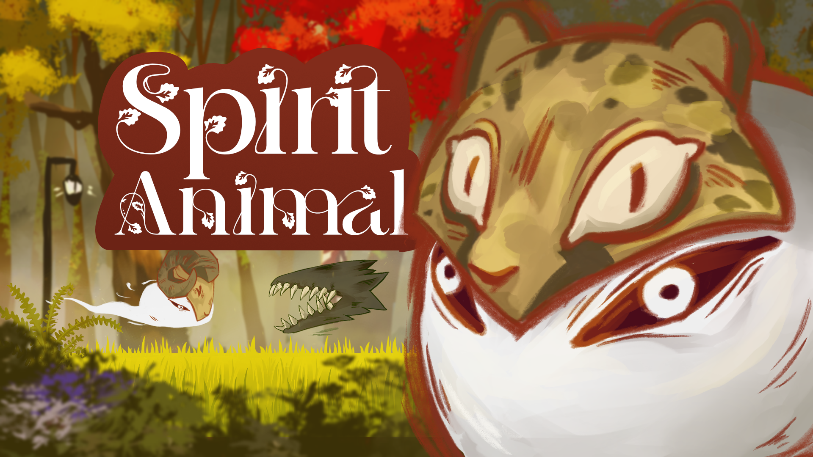

# Spirit Animal

GGJ 2026 entry form Leipzig Germany

Made in Godot within 48h (+ some bug fixing) in a team of 5 (3 devs, 1 artist and 1 sound designer)

No vibe coding, not asset generation

Check the ggj entry out on [https://globalgamejam.org/games/2026/spirit-animal-2](https://globalgamejam.org/games/2026/spirit-animal-2)

Play it in browser: [https://delwin444.itch.io/spirit-animal](https://delwin444.itch.io/spirit-animal)

## About

You play as a nameless soul traversing the woods in a realm where the memories of ancient beasts lie dormant in carved wooden masks. To survive the corruption spreading through the forest, you must awaken the power of those dormant animals.

### Controls
Movement: WASD + Space
Dash: Shift
Open Chest: E
Inventory: I
Attack: Left Click
Range Attack: Right Click (with Lama mask)

Controller should work, except for the inventory.

### Masks
- Ram: Enemies can be pushed back (you still take damage, ram doesn't care tho)
- Cheetah: More speed
- Bunny: Double jump
- Lama: Range Attack unlocked

### Free assets used
chests: [https://admurin.itch.io/free-chest-animations](https://admurin.itch.io/free-chest-animations)
